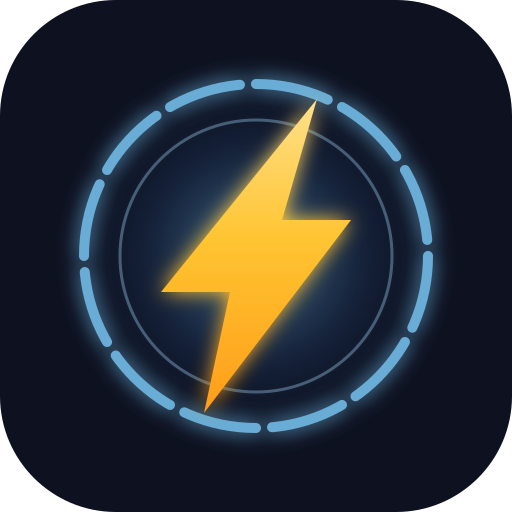
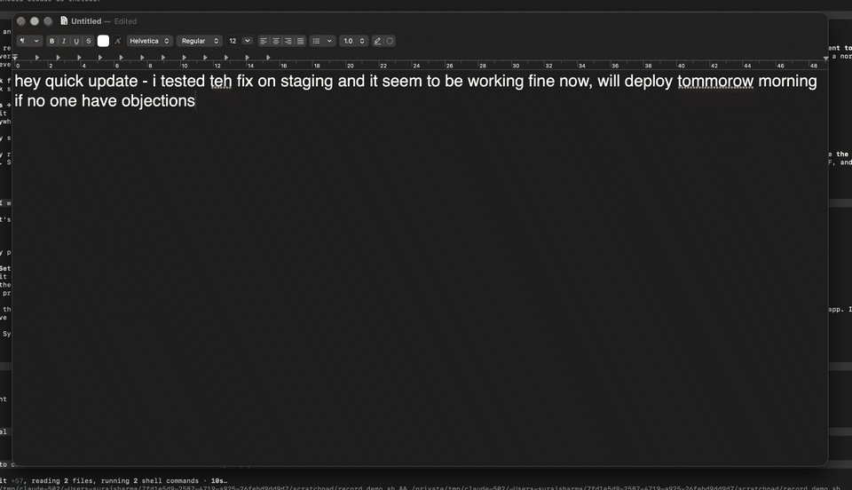
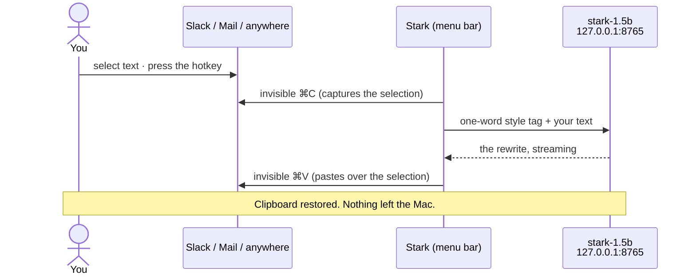
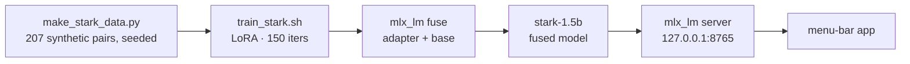

<div align="center">
  
  <h1>Stark</h1>
  <p><b>Grammarly, but better. And it never leaves your Mac.</b></p>
  <p>
    
    
    
    <a href="https://huggingface.co/suraj10620/stark-1.7b"></a>
  </p>
</div>

**Your words, only better.** A small language model fine-tuned for rewriting,
living in your menu bar, running entirely on your Mac's own silicon. No
account. No cloud. No subscription. Airplane mode is a supported
configuration.

## Why this exists

Every mainstream writing assistant is a cloud service wearing a local UI. To
fix a comma, it ships everything you type (investor updates, performance
reviews, medical questions, the resignation letter you never sent) to servers
you don't control, keeps it long enough to "improve the service", and bills
you monthly for the privilege.

A grammar checker shouldn't be a keylogger with good branding.

Stark is the counter-argument:

- **On-device.** A 1.5B-parameter model streams rewrites at ~97 tokens/sec on
  Apple silicon, ~1 GB of RAM. Turn the Wi-Fi off; nothing changes.
- **Instant.** ~0.1 s to first token. The rewrite lands before a cloud
  round-trip would have finished its TLS handshake.
- **Yours.** MIT app, Apache-2.0 model, fully synthetic seeded dataset. The
  whole thing is reproducible end to end on one MacBook.
- **Free.** Electricity sold separately.

## How it works



1. **Select text.** Any app.
2. **Press the hotkey** (default ⌃⌥S, yours to change).
3. **Done.** The rewrite lands where the text was. Your clipboard is
   untouched. Your secrets stay unshipped.

Nothing selected? Stark works on your clipboard instead and lets you pick a
style. First run: allow Accessibility (System Settings → Privacy & Security),
which is how the invisible copy/paste happens. It's the only permission Stark
asks for. There's no network permission because there's no network code.

<details>
<summary><b>Under the hood</b></summary>



</details>

## One suit, eight loadouts

| Key | Style | What it does |
|-----|-------|--------------|
| 1 | Polish | fixes grammar and flow, keeps your meaning and tone |
| 2 | Concise | says the same thing in fewer words |
| 3 | Formal | professional tone |
| 4 | Friendly | warm, casual tone |
| 5 | Fix typos | spelling only, never rephrases |
| 6 | Bullets | turns prose into a markdown bullet list |
| 7 | Prompt enhance | sharpens a vague LLM prompt into a precise one |
| 8 | Expand | grows a terse note into a fuller message: same meaning, no invented facts |

The one-press rewrite uses your default style. Pick it in the menu bar →
**Default Style** (`polish` out of the box). The rest live in the **Rewrite
As** submenu (also one-shot when text is selected) and in the clipboard-mode
picker. Styles can follow the app you're in: Slack can default to
friendly-then-concise, Mail to formal, your editor to typos-only. See
personas in the appendix.

## Suit up

```bash
curl -fsSL https://raw.githubusercontent.com/YoursSarcastically/stark/main/install.sh | bash
```

That downloads Stark, puts it in `/Applications`, fetches the model, and opens
it. Nothing else lands on your machine — no Python, no Homebrew, no build
tools. Needs macOS 14+, Apple silicon, and about 4 GB of disk.

Install this way rather than opening the DMG by hand. Stark is signed but not
notarized — that needs a paid Apple Developer account — so a DMG you download
in a browser is blocked by Gatekeeper, and macOS 15 removed the Control-click
→ Open escape hatch. The installer clears the quarantine flag for you, so
there is no warning to click through.

Building from source instead: `git clone` the repo and run `app/make_app.sh`.

Two things afterwards: grant **Accessibility** when macOS asks — that is how
the invisible copy and paste happen, and rewriting does nothing without it —
then give the model about ten seconds to warm up, select some text anywhere and
press **⌃⌥S**.

Ghost-text predictions as you type are off by default; turn them on from the
menu bar → **Predictive Typing**.

To remove everything: `rm -rf ~/.stark ~/Stark`.

## Why it's fast and small

- The model is a 4-bit **Qwen2.5-1.5B** with a LoRA fine-tune baked in,
  trained and fused on a MacBook; about **1 GB of RAM** while running.
- Each style is a **one-word system tag** (`polish`, `concise`, …), so
  there's almost no prompt to process and the model answers with the rewrite
  only: no "Here's your polished text!" preamble to wait for.
- The app itself is native Swift, ~400 KB, zero dependencies.

A faster/smaller 0.5B variant is also trained (`model/adapters-0.5b`); see
the appendix for switching.

## Where this is going

Signed releases, custom user-trained styles, translate/summarize, a CLI:
the plan lives in [ROADMAP.md](ROADMAP.md).

<details>
<summary><b>Appendix: technical details</b></summary>

### Layout

```
Stark/
├── assets/                  # logo
├── design/                  # product/onboarding design pitch (HTML)
├── model/
│   ├── make_stark_data.py   # generates the synthetic dataset (207 pairs, 8 presets)
│   ├── data/                # train.jsonl / valid.jsonl (regenerated by make_stark_data.py)
│   ├── train_stark.sh       # LoRA via ~/mlx-finetune venv (mlx_lm 0.31.3)
│   ├── eval_stark.py        # held-out eval + latency/memory benchmark
│   ├── aura_train.py        # optional: retrain on your own accepted rewrites
│   ├── adapters-1.5b/       # LoRA adapter checkpoints (not in git)
│   └── stark-1.5b/          # fused model the app serves (not in git; see below)
├── server/run_server.sh     # standalone server (app normally manages this)
└── app/                     # native Swift menu-bar app (SwiftPM)
    └── make_app.sh          # builds build/Stark.app
```

### The pipeline



The trained weights aren't in this repo. Either download the fused model from
[Hugging Face](https://huggingface.co/suraj10620/stark-1.7b) into
`model/stark-1.5b/`, or reproduce it locally (the dataset generator is seeded,
so you get the same data):

```bash
cd model
python make_stark_data.py && ./train_stark.sh 1.5b
python -m mlx_lm fuse --model mlx-community/Qwen2.5-1.5B-Instruct-4bit \
    --adapter-path adapters-1.5b --save-path stark-1.5b
```

### Model & training

- Base: `mlx-community/Qwen2.5-1.5B-Instruct-4bit` (QLoRA on the quantized model).
- Data: fully synthetic. Hand-authored rewrite pairs per preset plus
  programmatic typo-corruption for the `typos` preset. No customer data.
- Training: `./train_stark.sh 1.5b`: 150 iters, lr 1e-4, batch 4, 16 layers,
  checkpoint every 25 iters. The served model is the final adapter fused into
  a standalone model with `mlx_lm fuse` (the mlx_lm 0.31.3 server silently
  ignores `--adapter-path`, so fusing is required, not optional).

### Serving

The app spawns
`python -m mlx_lm server --model <fused model dir> --host 127.0.0.1 --port 8765`
with `HF_HUB_OFFLINE=1`, health-checks `/v1/models`, and kills it on quit.
It exposes the standard OpenAI chat-completions API, so you can also hit it
directly:

```bash
curl -s localhost:8765/v1/chat/completions -d '{
  "messages": [{"role":"system","content":"concise"},
               {"role":"user","content":"I just wanted to quickly reach out to ask whether..."}],
  "temperature": 0.2, "max_tokens": 512
}'
```

### Configuration

Optional `~/.stark/config.json` (all fields required if the file exists):

```json
{
  "port": 8765,
  "python": "~/mlx-finetune/.venv/bin/python",
  "model": "~/Stark/model/stark-1.5b",
  "adapterPath": "",
  "maxTokens": 4096,
  "temperature": 0.2,
  "hotkey": "ctrl+alt+s",
  "preset": "polish"
}
```

`hotkey` is any combination of `cmd`/`ctrl`/`alt`/`shift` plus one letter or
digit, e.g. `"cmd+shift+9"`. Invalid specs fall back to `ctrl+alt+s`.
`preset` is the style tag used for one-shot in-place rewrites (`polish`,
`concise`, `formal`, `friendly`, `typos`, `bullets`, `prompt`, or `expand`).
Easier: set it from the menu bar → **Default Style**.
Per-app persona chains (e.g. Slack → friendly then concise) are configured in
the onboarding flow (menu bar → Run Setup…) and stored under `personas`.

### Long texts

The fine-tune was trained on short pairs, so a whole document in one request
drops paragraphs and stops fixing typos past a few hundred words. The client
therefore splits long inputs (>500 chars) into paragraph chunks (sentence
groups for oversized paragraphs), rewrites each separately, and reassembles.
Benchmarked on the M4: ~0.6 s per paragraph, ~1,000-word document in ~18 s
with all paragraphs preserved.

### In-place rewriting

On the hotkey, Stark captures the selection from the frontmost app with a
synthetic ⌘C, streams the rewrite in the floating panel, then refocuses the
app and pastes over the selection with a synthetic ⌘V. Your clipboard is
saved and restored on both legs. Posting keystrokes requires Accessibility;
the app is ad-hoc signed, so macOS drops that grant after every rebuild.
Re-toggle Stark in System Settings → Accessibility after `make_app.sh`.

To use the faster 0.5B model, fuse `adapters-0.5b` the same way and point
`model` at the fused `~/Stark/model/stark-0.5b`, then menu-bar → Restart
Server.

### App internals

Pure AppKit/SwiftUI, no dependencies. Carbon `RegisterEventHotKey` for the
global hotkey (the hotkey itself needs no Accessibility permission; only the
⌘C/⌘V posting for in-place mode does), `NSPanel` + `NSHostingView` for the
picker, SSE streaming from the local server, `NSPasteboard` in/out.
`LSUIElement` so there's no Dock icon.

### Credits

Inspired by [pebble](https://github.com/gashiartim/pebble), but native (no
Electron, no Ollama) and powered by our own model. Onboarding backgrounds
from [Unsplash](https://unsplash.com).

</details>

<p align="center"><sub>Built on a MacBook, not in a data center. ⚡</sub></p>
